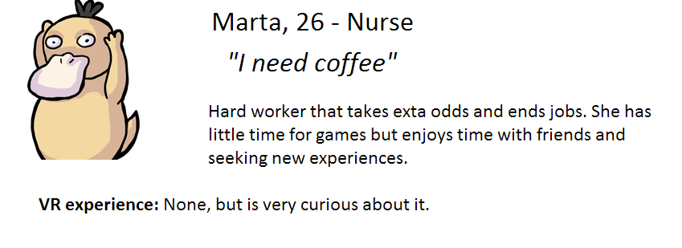
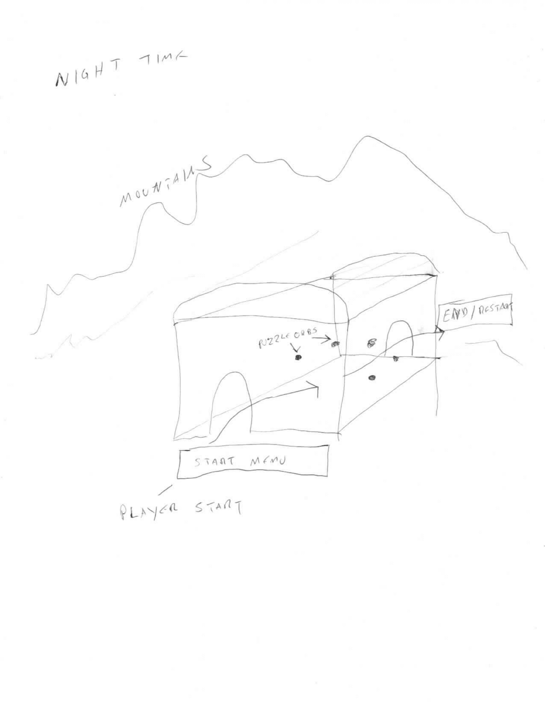
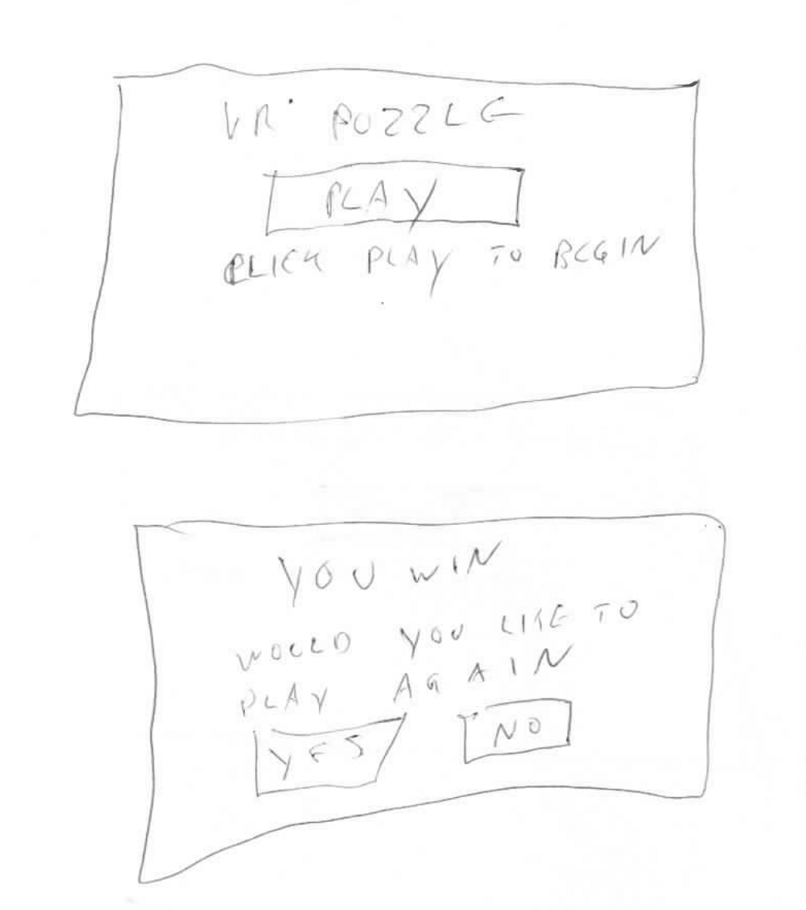
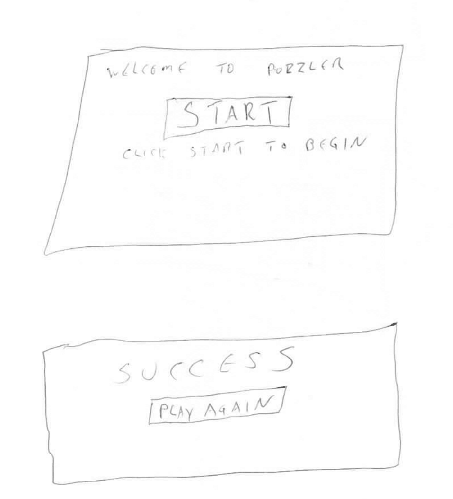
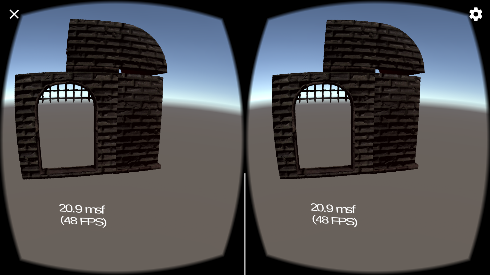
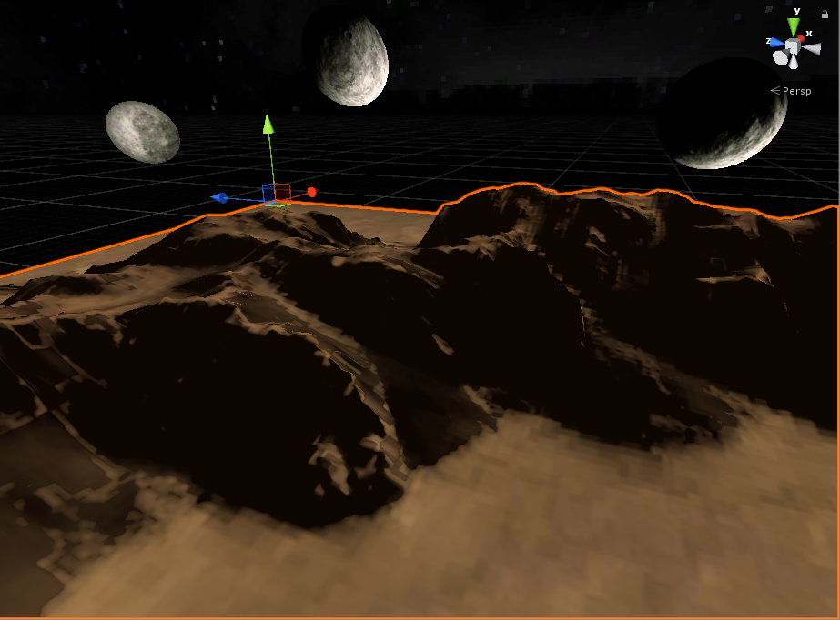
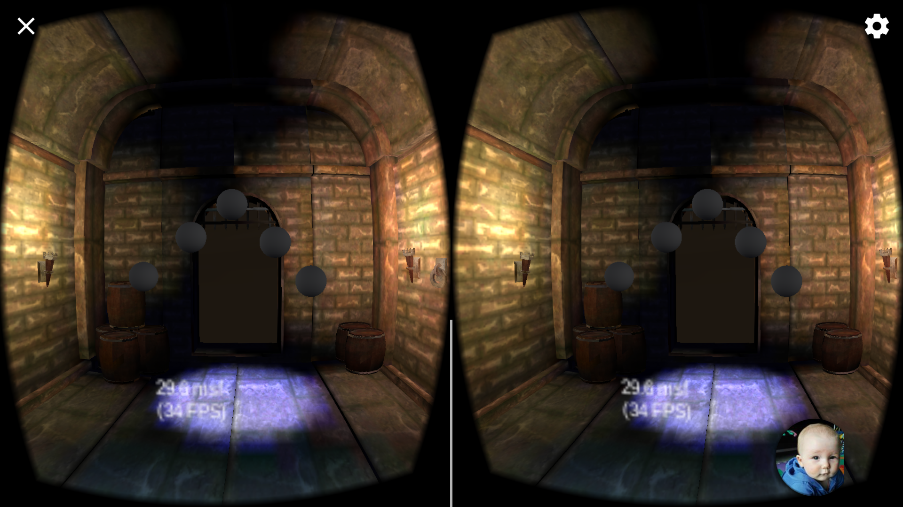
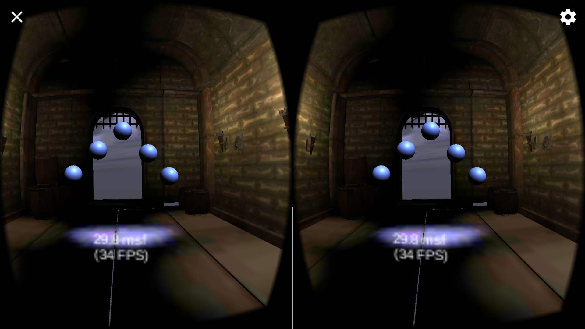
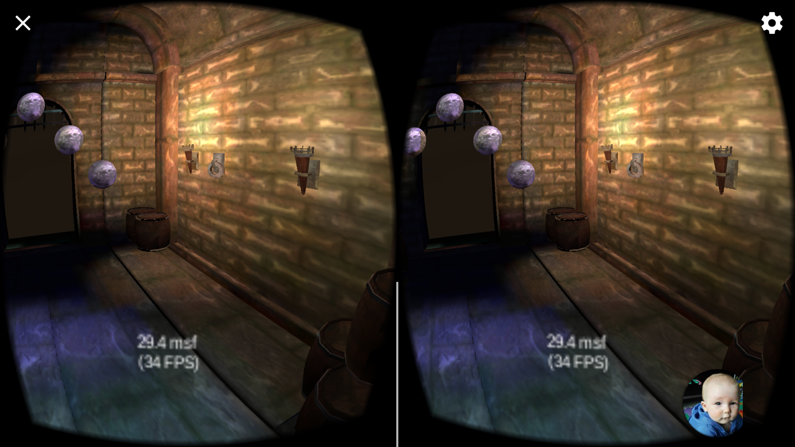
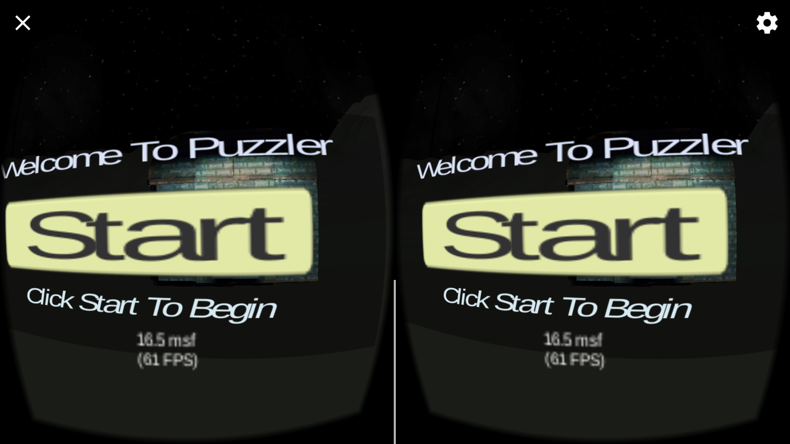

<h1>Puzzler</h1>
<h2>Statement of purpose
  Puzzler is a VR app that allows users to experience a small VR experience that does not require a large time investment to enjoy. 
 </h2>
<iframe width="850" height="300"
src="PuzzlerMovemntMechanic.webm">
</iframe>
<h2>Process
</h2>
<h3> Profile<h3>

<h3>Design sketches</h3>

<h3>Iterations</h3>

